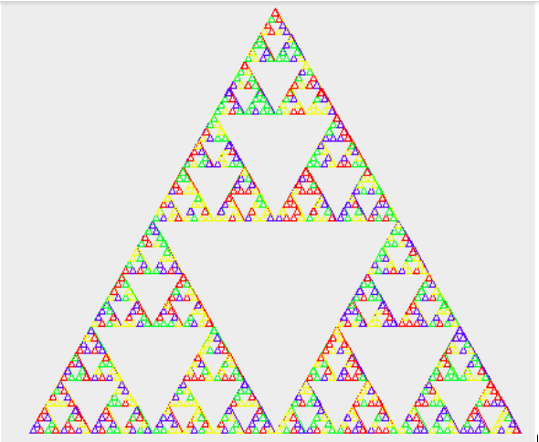

# NF11-project

A student homework to learn the language theory basics.

This project was code in Java

------------
[Website of the course](http://moodle.utc.fr/course/view.php?id=926)

[Subject in pdf](http://moodle.utc.fr/pluginfile.php/74138/mod_resource/content/2/ressource_TP/NF11-tp_prodcode.pdf)

----------
Feel free to contribute by create a pull request or asking a question through github issues
